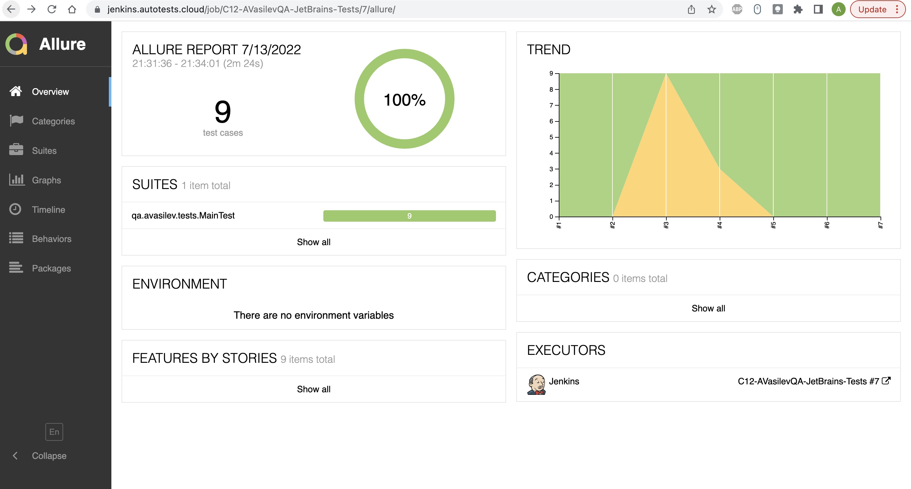
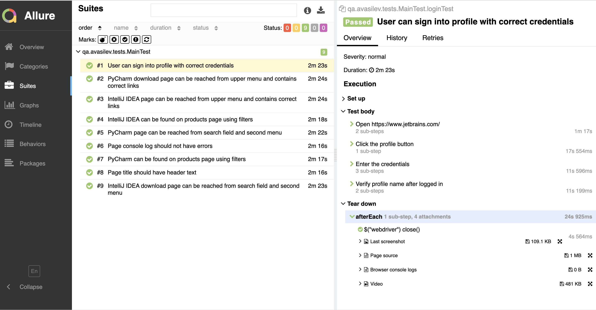
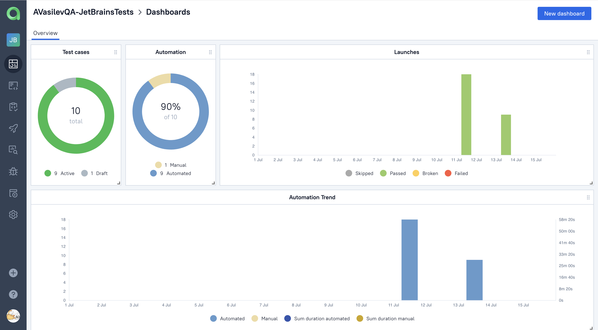
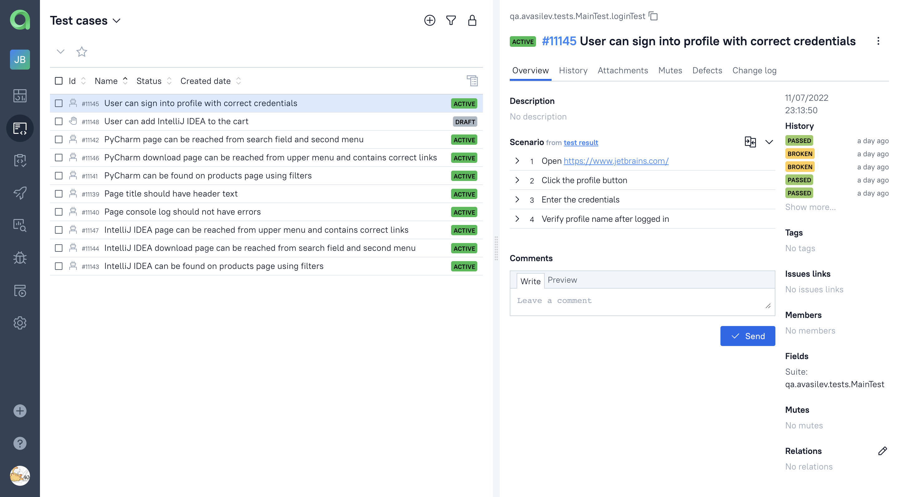
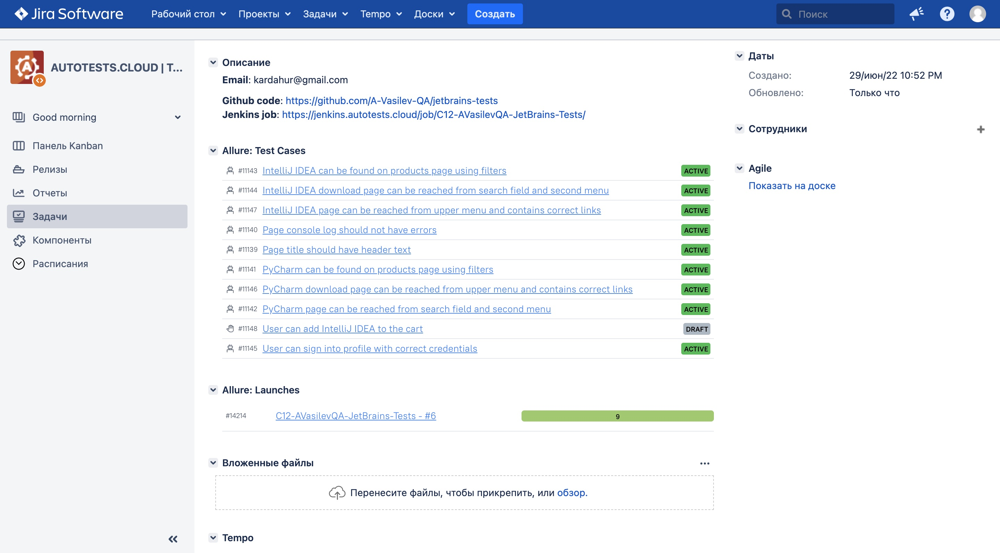
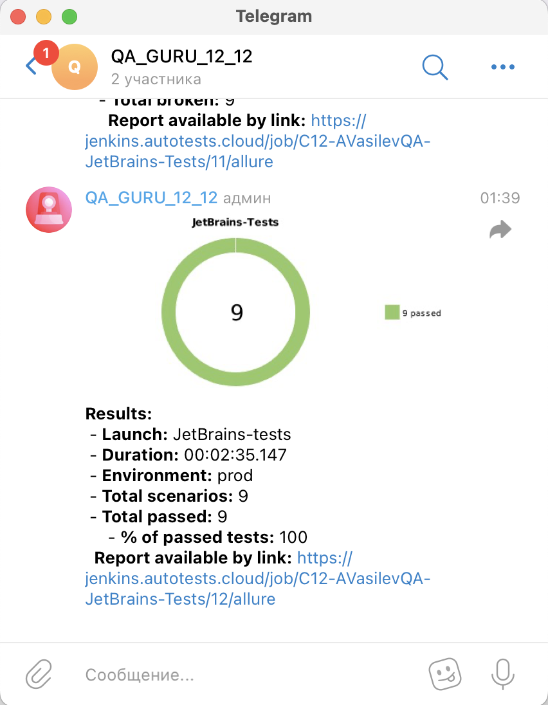
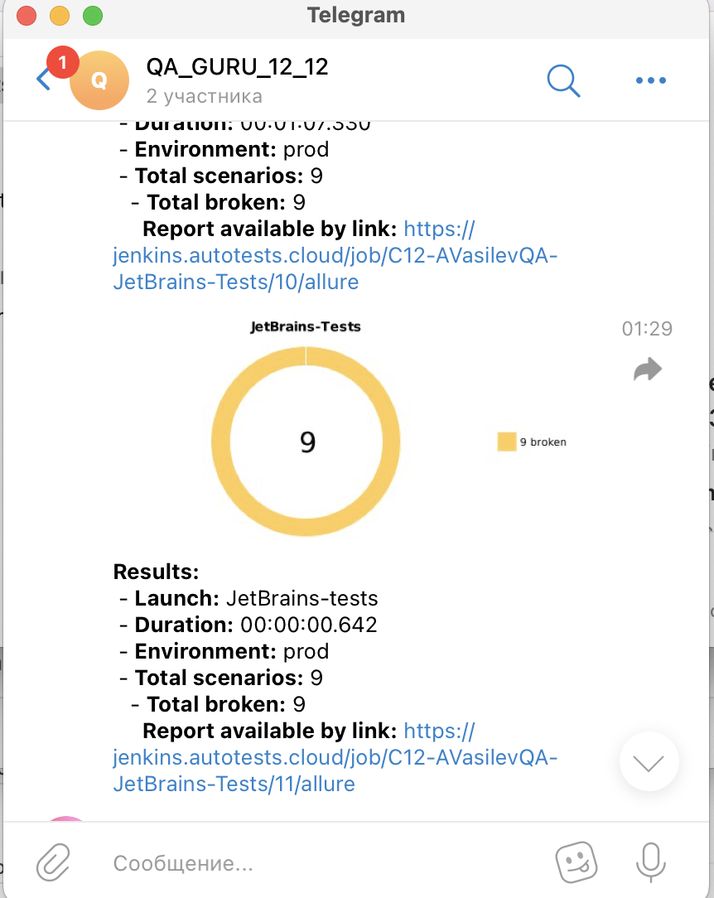
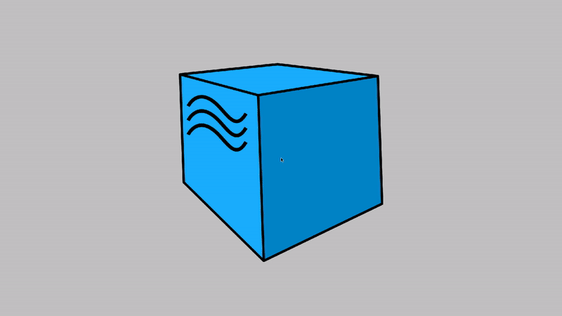

# Test automation project for JetBrains main page
##### <a target="_blank" href="https://jetbrains.com">JetBrains website link</a> 

### Table of contents
- [Tools and technologies](#%EF%B8%8F-tools-and-technologies)
- [Implemented test scenarios](#-implemented-test-scenarios)
- [Jenkins job](#-jenkins-job)
- [Reporting in Allure](#-reporting-in-allure)
- [Integration with Allure TestOps and Jira](#-integration-with-allure-testops-and-jira)
- [Notifications](#-notifications)
- [Video example](#-video-example)

## ⚙️ Tools and technologies
<p align="left">


 


</p>

##  Implemented test scenarios
- Verify that page title contains header text
- IntelliJ IDEA page can be reached from upper menu and contains correct links
- IntelliJ IDEA download page can be reached from search field and second menu
- IntelliJ IDEA can be found on products page using filters
- PyCharm page can be reached from upper menu and contains correct links
- PyCharm download page can be reached from search field and second menu
- PyCharm can be found on products page using filters

##  Jenkins job
<a target="_blank" href="https://jenkins.autotests.cloud/job/C12-AVasilevQA-JetBrains-Tests/">Job link</a>

###  Usage examples
#### For remote launch it's needed to fill remote.properties or to pass value:

* browser (default chrome)
* browserVersion (default 100.0)
* browserSize (default 1920x1080)
* browserMobileView (mobile device name, for example iPhone X)
* remoteDriverUrl (url address from selenoid or grid)
* videoStorage (url address where you should get video)
* threads (number of threads)


#### Run tests with filled remote.properties:
```bash
gradle clean test
```

#### Run tests with not filled remote.properties:
```bash
gradle clean -DremoteDriverUrl=https://%s:%s@selenoid.autotests.cloud/wd/hub/ -DvideoStorage=https://selenoid.autotests.cloud/video/ -Dthreads=1 test
```

#### Serve report:
```bash
allure serve build/allure-results
```
##  Reporting in Allure

#### After test execution a report is created:

#### Report overview


#### Screeen with test suite



##  Integration with Allure TestOps and Jira

#### Integration with TMS Allure TestOps and Jira is implemented:

#### Allure TestOps Dashboard


#### Allure TestOps Suite


#### JIRA Task


##  Notifications 
#### An option to send notifications via email and messengers is implemented
#### For example notifications in Telegram:
<p align="center">
  
</p>

##  Video example
#### There is an option to provide a video for every test executed in suite

#### A video example:


:heart: <a target="_blank" href="https://qa.guru">qa.guru</a><br/>
:blue_heart: <a target="_blank" href="https://t.me/qa_automation">t.me/qa_automation</a>
